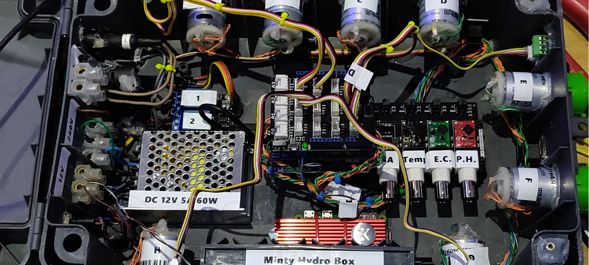

# MHC - Minty Hydroponic Controller


See the [online demo](https://mintyhydro.netlify.app/) - **Note**: this is not 100% functional due to it not actually being connected to an Arduino and the backend node side not running.




Start both required servers using:-
```
npm run hydro
```

Start servers using `forever` using:-
```
npm start hydro-forever
```
